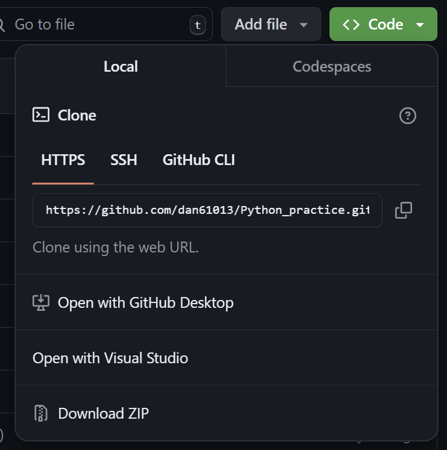
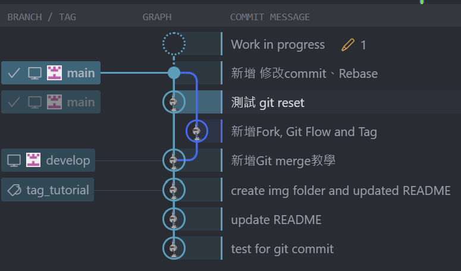

# Git Tutorial

Reference:

- [曼曼來比較快_Git 版本控制](https://ithelp.ithome.com.tw/users/20139195/ironman/4770)

Table of contents:

- [Git Tutorial](#git-tutorial)
  - [01 Local Repository](#01-local-repository)
  - [02 Remote Repository](#02-remote-repository)
  - [03 Clone](#03-clone)
  - [04 Pull](#04-pull)
  - [05 Checkout](#05-checkout)
    - [05-1 HEAD](#05-1-head)
    - [05-2 Branch](#05-2-branch)
- [\<\<\<\<\<\<\< HEAD](#-head)
  - [06 Fork](#06-fork)
  - [07 Git Flow](#07-git-flow)
  - [08 Tag](#08-tag)
  - [06 Fork](#06-fork-1)
  - [07 Git Flow](#07-git-flow-1)
  - [08 Tag](#08-tag-1)
  - [09 修改Commit](#09-修改commit)
    - [09-1 Reset](#09-1-reset)
    - [10 Rebase](#10-rebase)
>>>>>>> 3489342b3169882c8af41f112ab724e57f53ccaf

## 01 Local Repository

步驟(Windows):

1. `cd FolderPath`
2. `git init`: 初始化
3. `git status`: 查看狀態
4. `git add .`: 將資料夾中的檔案加入Index
   1. or `git add FilePath`
5. `git commit -m "MessageContent"`: 從Index commit到local repository
6. 使用`git status`查看狀態
7. `git log`可以查看完整的commit資訊

## 02 Remote Repository

步驟:

1. 登入[GitHub](https://github.com/)
2. Create new repository
3. 依照指令進行push existing repository
   1. `git remote add YourRepositoryURL`
   2. `git branch -M main`
   3. `git push -u origin main`
4. 完成上傳

## 03 Clone

將GitHub上的Remote repository下載到本機。

步驟:

1. 先到repository的`code`標籤中複製URL
   
2. 輸入指令: `git clone https://github.com/dan61013/Python_practice.git`
3. 完成Clone

## 04 Pull

> 通常用於多人協作時，當需要拉取最新版本時使用。

指令: `git pull origin main`

## 05 Checkout

### 05-1 HEAD

> HEAD指的是當前所在的分支(branch)

到目前為止，練習過程中只有新增一個branch，也就是`main`

而在`main`當中也會有多次commit的紀錄，可以透過指令進行版本切換

指令:

1. 可以用`type .git\HEAD`進行查看當前所在的branch
   1. 或是用`git log`可以同時查詢到HEAD指向與版本SHA-1編號
2. 輸入`git checkout CommitSHA-1`就可以切換到指定的版本號
3. 回到最新版本的方式可以省略版本號，即輸入`git checkout main`

### 05-2 Branch

> 透過Branch避免被其他人commit覆蓋的情形發生，

1. 先新增branch `git branch BranchName`
2. 切換到新增的branch(*develop*) -> `git checkout develop`
3. 接著執行`git add .`、`git commit -m`、`git push -u origin develop`，將修改紀錄新增到*develop*

這樣的作法讓*main*和*develop*產生差異(*develop*的版本較新)，因此將*develop*合併到*main*上。

步驟:

1. 切回*main*分支 -> `git checkout main`
2. 將*develop*合併到*main*上 -> `git merge develop`
3. 合併完成
<<<<<<< HEAD
=======

## 06 Fork

步驟:

1. 進入其他人的repository
2. 點擊`Fork`按鈕(會將repository複製一份到自己的GitHub上)
3. 修改檔案(略)
4. 然後再透過`pull requests`向原作者提交修改申請

## 07 Git Flow

多人協作時定義的主要5種分支:

- **Main**: 穩定、上線中的版本。
- **Develop**: 開發中的版本分支，測試穩定後合併到*main*。
- Feature Branch: 新增功能時使用的分支，完成後會合併到*develop*。
- Hotfix Branch: 緊急修復分支，當*main*分支的上線版本發生問題時，會建立此分支進行修復。
- Release Brach: 預發布分支，當*develop*分支功能測試差不多後，就可以合併到此分支上，在上線到*main*分支前最終測試的環節。

## 08 Tag

> 標籤與分支十分相似，而分支會隨著commit移動，標籤則不會。

可以把`tag`想成**標記點**，而且儲存位置也與`branch`不同

`tag`共分為2種類型:

- Lightweight tag: 通常用於私有情境中
- Annotated tag: 帶有標記的tag，通常用於正式、發布版本

步驟:

1. 查詢目前所有commit的SHA-1碼 -> `git log --oneline` (一行式顯示log)
2. 新增tag -> `git tag TagName CommitSHA-1`
3. 查看tag -> `git tag`
4. 新增Annotated tag的方式為:
   1. `git tag TagName CommitSHA-1 -a -m "MessageContent"`

※ 查看指定關鍵字的tag -> `git tag -l "Content*"`
>>>>>>> 3489342b3169882c8af41f112ab724e57f53ccaf

## 06 Fork

步驟:

1. 進入其他人的repository
2. 點擊`Fork`按鈕(會將repository複製一份到自己的GitHub上)
3. 修改檔案(略)
4. 然後再透過`pull requests`向原作者提交修改申請

## 07 Git Flow

多人協作時定義的主要5種分支:

- **Main**: 穩定、上線中的版本。
- **Develop**: 開發中的版本分支，測試穩定後合併到*main*。
- Feature Branch: 新增功能時使用的分支，完成後會合併到*develop*。
- Hotfix Branch: 緊急修復分支，當*main*分支的上線版本發生問題時，會建立此分支進行修復。
- Release Brach: 預發布分支，當*develop*分支功能測試差不多後，就可以合併到此分支上，在上線到*main*分支前最終測試的環節。

## 08 Tag

> 標籤與分支十分相似，而分支會隨著commit移動，標籤則不會。

可以把`tag`想成**標記點**，而且儲存位置也與`branch`不同

`tag`共分為2種類型:

- Lightweight tag: 通常用於私有情境中
- Annotated tag: 帶有標記的tag，通常用於正式、發布版本

步驟:

1. 查詢目前所有commit的SHA-1碼 -> `git log --oneline` (一行式顯示log)
2. 新增tag -> `git tag TagName CommitSHA-1`
3. 查看tag -> `git tag`
4. 新增Annotated tag的方式為:
   1. `git tag TagName CommitSHA-1 -a -m "MessageContent"`

※ 查看指定關鍵字的tag -> `git tag -l "Content*"`

## 09 修改Commit

共有3種方式:

- 刪除`.git`資料夾
- `git reset`重新設定commit
- 使用`--amend`參數修改**最新**的commit訊息

### 09-1 Reset

> 用於修改上一次或前N次的Commit

[參考資源](https://gitbook.tw/chapters/using-git/reset-commit)

指令:

- 修改上一次 -> `git reset main^` or `git reset HEAD^`
- 修改某一次 -> `git reset SHA-1`

步驟:

1. `git reset SHA-1`
2. `git add .`
3. `git commit -m "NewCommitMessage"`: 輸入要修改的commit message
4. `git pull`將HEAD指回最新的SHA-1
5. `git add .`
6. `git commit -m "TheLatestCommitMessage"`: 輸入最新(當前HEAD)的commit message
7. `git push -u origin main`
8. 完成修改歷史紀錄中的一筆commit，並上傳最新的commit
   

### 10 Rebase

> `git rebase`是重新定義branch基準點

[參考資源](https://medium.com/@wadehuang.developer/git-15-git-%E5%B8%B8%E7%94%A8%E6%8C%87%E4%BB%A4-git-rebase-7e4ed0b419d0)

指令: `git rebase BranchName` (這裡的分支名稱指的是**被合併**的分支名稱)

如果無法一次執行完成(有問題產生)，則透過手動解決衝突:

1. `git add .`
2. `git commit -m "MessageContent"`
3. `git rebase --continue`

此外，也可以執行跳過或退出:

- Skip -> `git rebase --skip`
- 退出 -> `git rebase --abort`
